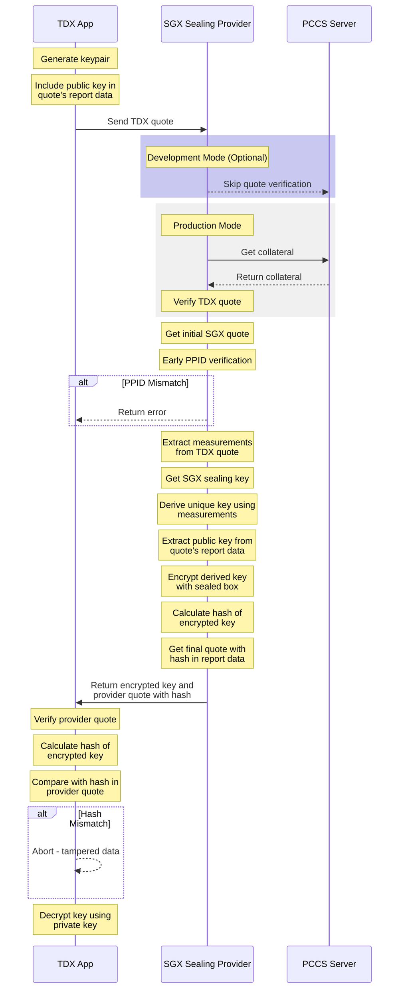

# Gramine Sealing Key Provider

A stateless service that provides sealing key functionality for TDX (Trust Domain Extensions) workloads using an SGX (Software Guard Extensions) enclave as a key provider.
You can read more about this tool in this [blog post](https://collective.flashbots.net/t/loose-seal-enabling-crash-tolerant-tdx-applications-by-utilizing-sgx-sealing-provider-sidecar/4243).

## Overview

This service acts as a secure bridge between TDX workloads and SGX sealing keys, allowing TDX workloads to derive unique keys based on their measurements while ensuring they're running on the same platform using PPID verification.

### Key Features

- Stateless design for simplicity and security
- DCAP quote verification for platform validation (configurable)
- Measurement-based key derivation for TDX workloads
- PPID matching to ensure same-platform operation
- Public key encryption of derived keys
- Development mode for testing
- Detailed debug logging for troubleshooting

## System Flow



## Prerequisites

- Intel CPU with SGX and TDX support
- Gramine installed (version 1.5 or higher)
- Rust toolchain (tested with rustc 1.82.0)
- DCAP driver and related software stack
- Linux environment (Ubuntu 22.04 LTS)

## Building

1. Clone the repository:
```bash
git clone https://github.com/MoeMahhouk/gramine-sealing-key-provider.git
cd gramine-sealing-key-provider
```

2. Build the project:
```bash
# Production build
make SGX=1

# Development build (skips quote verification)
make SGX=1 DEV_MODE=1

# Build with debug logging
make SGX=1 DEBUG=1 DEV_MODE=1
```

## Usage

### Development/Testing Mode

```bash
# Copy your TDX quote
cp /path/to/your/tdx_quote /quotes/

# Run the provider in development mode
make SGX=1 DEV_MODE=1 run-provider

# With debug logging
make SGX=1 DEBUG=1 DEV_MODE=1 run-provider
```

### Production Mode

```bash
# Run the provider with full security features
make SGX=1 run-provider
```

### Testing
```bash
# Run the test client python that wraps your quote and sends it to the SGX sealing provider through TCP
python test_client.py
```

### Output

The service outputs the encrypted derived key in hexadecimal format to stdout. In debug mode, it also provides detailed logging about:
- Quote parsing and verification
- PPID comparison
- Measurement extraction
- Key derivation steps
- Encryption process

## How It Works

1. TDX App Preparation:
   - Generates a keypair
   - Includes public key in quote's report data
   - Generates TDX quote

2. Service Operation:
   - Receives TDX quote as input
   - Verifies quote with DCAP (in production mode)
   - Retrieves its own SGX quote and sealing key
   - Compares PPIDs from both quotes
   - Extracts measurements from TDX quote
   - Derives unique key using measurements and SGX sealing key
   - Encrypts derived key with public key from quote
   - Returns encrypted key

3. TDX App Completion:
   - Receives encrypted key
   - Decrypts using private key

## Security Considerations

- Service operates within an SGX enclave
- PPID matching ensures same-platform operation
- Quote verification in production mode
- Public key encryption of derived keys
- Development mode clearly marked with warnings
- Measurement-based key derivation provides unique keys per TDX workload

## Future Work

### Security Enhancements
- [ ] Implement Attested TLS (aTLS) connection to the service for secure communication
- [ ] Use public key from TDX quote's user report data to encrypt response
- [ ] Remove insecure command-line arguments and quotes folder access
- [ ] Add quote freshness verification
- [ ] Implement rate limiting to prevent abuse

### Feature Additions
- [ ] Support for multiple key derivation algorithms
- [ ] Add key rotation capabilities
- [ ] Support for key hierarchies
- [ ] Add configuration for custom measurement selection
- [ ] Implement key usage policies

### Architectural Improvements
- [ ] Create a proper client SDK
- [ ] Add health monitoring endpoints
- [ ] Implement proper error handling with detailed error codes
- [ ] Add metrics collection
- [ ] Create a configuration system for deployment flexibility

## Design Considerations for Future Versions

### Current Limitations
1. Basic file-based I/O system
2. Limited error handling
3. No encryption of responses
4. Command-line based interface

### Proposed Improvements
1. Network Protocol
   - Implement a proper RPC or REST API
   - Use aTLS for secure communication
   - Add authentication mechanisms

2. Key Management
   - Support for key hierarchies
   - Key rotation policies
   - Backup mechanisms

3. Security
   - Quote freshness validation
   - Response encryption
   - Access control mechanisms

4. Monitoring
   - Health checks
   - Performance metrics
   - Audit logging

## Contributing

Contributions are welcome! Please feel free to submit pull requests or open issues for discussion.

## License

This project is licensed under MIT license - see the LICENSE file for details.